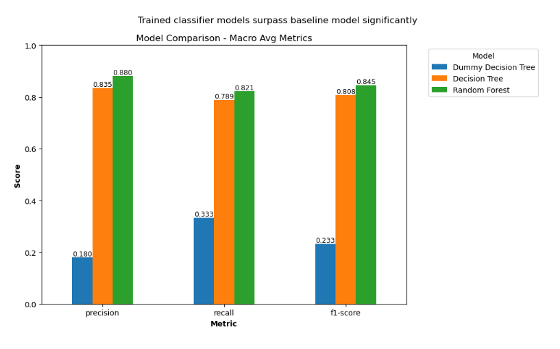
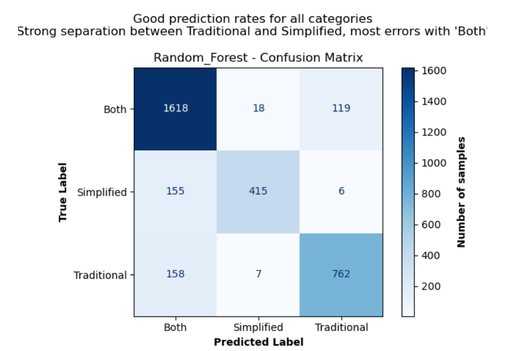
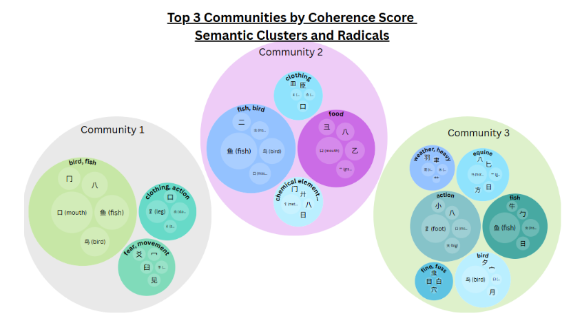
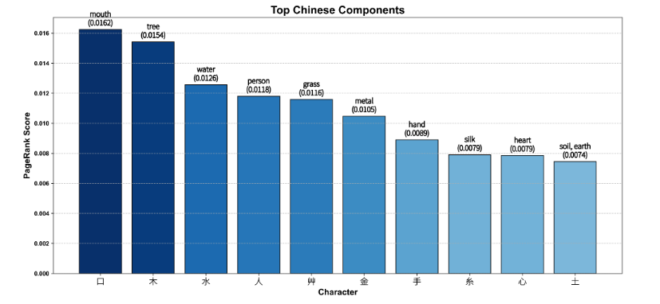

# Chinese Characters & Radicals Analysis

[](https://www.python.org/)
[](https://scikit-learn.org/)
[](https://networkx.org/)
[](https://sbert.net/)

An extensive data science and computational linguistics project analyzing the structural, semantic, and categorical properties of Chinese characters (Hanzi) using multi-source data integration, graph centrality algorithms, NLP embeddings, and supervised classification.

### 👥 Team Members
- **Or Waingortin**
- **Hadas Grossztein**
- **Eliana Haddad**
*(The Hebrew University of Jerusalem)*

---

## 📌 Project Overview

In the Chinese writing system, characters are formed from sub-graphical components and semantic radicals rather than alphabetic letters. Additionally, the orthography is split into Traditional and Simplified writing forms.

This project creates an integrated Chinese character database to investigate three primary research questions:
1. **Category Prediction:** Can we predict whether a character is Traditional, Simplified, or shared across Both systems based purely on structural features?
2. **Structural vs. Semantic Coherence:** Do characters that share radicals and visual complexity form statistically coherent semantic clusters?
3. **Component Centrality via PageRank:** Which radicals and structural components serve as the fundamental topological building blocks of the language?

---

## 📊 Data Pipeline & Engineering

Because no single dataset fully captures character variants, pronunciations, and hierarchical decompositions, data was synthesized across several disparate sources (~40 MB total):

### 1. Unicode Unihan Database (~40 MB)
- `RSIndex.txt`: Identified the top 50 most common radicals and their associated characters based on Kangxi radical dictionary classifications.
- `Unihan_Variants.txt`: Extracted `kSimplifiedVariant` and `kTraditionalVariant` mappings to classify writing systems.
- `Unihan_Readings.txt`: Extracted character pronunciations and English definitions (`kDefinition`).
- `Unihan_IRGSources.txt`: Extracted dictionary radical IDs (`kRSUnicode`) and stroke counts (`kTotalStrokes`). Apostrophes (`'`) were parsed to flag traditional vs. simplified base radicals.

### 2. Character Variant Extensions & Web Scraping
- `TSCharacters.txt` & `STCharacters.txt` (~34 KB each): Resolved variant mappings for ~4,000 edge-case characters.
- **Wiktionary Scraping** (`wiktionary_cache.csv`, 47 KB): Scraped remaining uncategorized characters to minimize missing system labels.

### 3. Radical & Component Decomposition
- **HanziCraft Scraping** (`decomposition_scraping.csv`, 360 KB): Scraped multi-level radical breakdowns per character, augmented with manual curation for edge cases.
- **Wikimedia Decomposition** (`wikimedia_decomposition.csv`, 730 KB): Parsed component decompositions across ~21,000 characters.
- **Radical Metadata** (`radicals_after_merge.csv`): Consolidated radical meanings and reference metadata sourced from YellowBridge and ArchChinese.

---

## 🛠 Methodology & Modeling

### 1. Script Category Classification (Simplified vs. Traditional vs. Both)
- **Feature Engineering:**
  - `total_strokes`: Total stroke count per character.
  - `is_simplified_radical`: Binary indicator of whether the dictionary radical is simplified.
  - `all_radicals`: One-hot encoded indicators for every sub-radical present in the character.
- **Models & Tuning:** Evaluated Decision Tree and Random Forest classifiers against a majority-class `DummyClassifier` baseline. Tuned via `GridSearchCV` on a 70/30 stratified train/test split optimizing for `f1_macro`.




### 2. Semantic Clustering & Modularity Analysis
- **Graph Construction:** Characters modeled as nodes; edges connect characters sharing $\ge 1$ radical and identical stroke count.
- **Community Detection:** Clustered using the **Louvain modularity algorithm**.
- **Semantic Evaluation:** Embedded character definitions using **Sentence Transformers** to compute pairwise semantic similarity penalized by variance. Theme heads were extracted using WordNet synset hypernym voting.
- **Validation:** Tested against size-preserving and size-randomized null permutation baselines.



### 3. Recursive Component Centrality (PageRank)
- **Network Construction:** Directed acyclic graph with **23,819 edges** linking characters recursively to immediate components until reaching sink radical nodes. Each character assigned a total credibility score of 1.0.
- **Algorithm:** PageRank with damping factor $\alpha = 0.85$.
- **Validation:** Evaluated stability across damping factors (Kendall's $\tau$) and benchmarked against raw frequency and node degree baselines.



---

## 💡 Key Results & Insights

- **Supervised Classification:**
  - **Random Forest achieved a 0.845 Macro F1** (0.880 Precision, 0.821 Recall), substantially outperforming the baseline (0.233 Macro F1).
  - The most influential features were base radical simplified status (~15.9%) and stroke count (~14.7%), followed by specific traditional radical flags (金, 糸, 貝). Confusion between Traditional and Simplified was minimal; the vast majority of classification errors stemmed from characters shared in Both systems.
- **Semantic Coherence:**
  - Louvain communities exhibited an average coherence score of **0.1190 vs. 0.1154–0.1159 under null models** (+2.8–3.1% above random chance), confirming that radical-sharing groups preserve semantic structure despite the presence of phonetic-compound noise.
- **Topological Centrality:**
  - PageRank rankings demonstrated near-perfect stability ($\tau \approx 0.9999$) and revealed key structural pillars: **口 (mouth, 0.0162), 木 (tree, 0.0154), 水 (water, 0.0126), and 人 (person, 0.0118)**, outperforming naive frequency heuristics (Jaccard similarity = 0.25).

---

## 📁 Repository Structure

```text
├── assets/         # TrueType fonts (Noto Sans SC) and visual artifacts
├── data/           # Linguistic datasets, scraped caches, and indices
├── src/            # Core Python modules (ETL, Graph Analytics, ML)
├── .gitignore
├── requirements.txt
└── README.md
```

---

## 🚀 Setup & Execution

### Prerequisites
- Python 3.8+

### Installation
Clone the repository and install dependencies:

```bash
git clone https://github.com/elianahaddad12/chinese-character-analysis.git
cd chinese-character-analysis
pip install -r requirements.txt
```

### Running the Pipeline
```bash
# 1. Build and harmonize the dataset
python src/build_dataset.py

# 2. Train and evaluate classification models
python src/decision_tree.py

# 3. Run PageRank on character decomposition networks
python src/pageRanker.py

# 4. Run Louvain community clustering and semantic analysis
python src/communities_alg.py
python src/HanziSemanticAnalyzer.py
```
